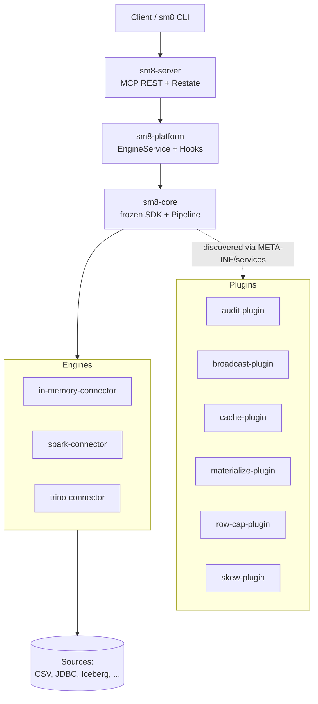

<div align="center">


<br><br>

[](https://github.com/EchoEnv/sm8/stargazers)
[](https://www.scala-lang.org/)
[](https://openjdk.org/projects/jdk/17/)
[](https://maven.apache.org/)
[](https://spark.apache.org/)

Run semantic models against Spark, Trino, or in-memory backends through one stable SDK — and add new behavior (engines, hooks, transforms) as Plugins without touching Core.

</div>

## What is this?

SM8 is a Scala 2.13 engine that lets you define semantic models (dimensions, measures, joins, calculated measures) and route queries to the right backend. The Core is mechanically Spark-free — `maven-enforcer-plugin` rejects `org.apache.spark:*` from every module except `connectors/spark-connector/`. Plugins are discovered via `META-INF/services` with a Maven-coordinates allowlist and run as Pre/Post hooks around the 4-stage pipeline.

## Architecture



## Quick Start

**Prerequisites:** JDK 17+. (Maven version per [`sm8-cli/README.md`](sm8-cli/README.md); the parent POM doesn't pin a minimum.)

```bash
# 1. Build the Core first — fast, no Spark, proves the SDK compiles
mvn -pl sm8-core -am test

# 2. Run the Core's test suite
mvn -pl sm8-core test
```

The `sm8-core` module compiles and tests **without Spark on the classpath** — enforced at two layers (Maven enforcer + `CoreClasspathSpec`).

### Define a Plugin

The Core exposes a 6-type SDK. A Plugin author implements `Plugin` and registers hooks + transformers via `engine.use(...)`:

```scala
import io.sm8.sdk._

class FlightsPlugin extends Plugin {
  def setup(engine: Engine): Unit = {
    engine.hooks.registerPostHook(/* audit/metrics hook */)
  }
}
```

Engine adapters are not a Plugin concern — data sources are wired by
the `EngineProvider` ServiceLoader seam in the connector modules
(see `connectors/`).

That's the entire Core API. No Spark, no Trino, no DuckDB imports — those are Plugin authors' concerns, not Core's.

### Build the full reactor

```bash
# Includes all connectors, plugins, server, and CLI. This downloads
# a fat Spark distribution for the spark-connector, so allow a few minutes.
mvn -DskipTests install
```

### Build a profile variant

```bash
# Verify the spark-connector against Spark 4.1 instead of 3.5
mvn -Pspark4 -pl connectors/spark-connector -am test
```

The `-Pspark4` profile swaps `spark.version` from 3.5 to 4.1. The Scala version, JVM target, and the API subset used by `spark-connector` are stable across both versions.

### Run the CLI

The CLI is a thin HTTP+JSON client for the REST APIs. It depends on **only `sm8-core`** (for SDK types) — proving the REST surface is the contract. See [`sm8-cli/README.md`](sm8-cli/README.md) for full usage.

```bash
mvn -pl sm8-cli -am install -DskipTests
ln -s "$(pwd)/sm8-cli/bin/sm8" /usr/local/bin/sm8

# Requires a running sm8-server (mvn -pl sm8-server ... then bootstrap it).
# See sm8-core/README.md and docs/ for the server bootstrap recipe.
```

## Project Structure

```
connectors/                  # Engine-portable adapters (one per engine)
├── in-memory-connector/
├── spark-connector/         # The ONLY reactor module allowed to depend on Spark
└── trino-connector/

plugins/                     # Hook Plugins discovered via META-INF/services
├── example-plugin/          # COPY-ME template for new plugin authors
├── audit-plugin/
├── broadcast-plugin/
├── cache-plugin/
├── materialize-plugin/
├── row-cap-plugin/
├── skew-plugin/
└── semantic-graph-plugin/

sm8-core/                    # Frozen Core — SDK + 4-stage pipeline. Spark-free.
sm8-platform/                # Engine-portable runtime: EngineService, hooks, Restate
sm8-server/                  # MCP REST + Restate handlers
sm8-cli/                     # HTTP+JSON CLI (depends only on sm8-core for SDK types)

docs/                        # ADRs, RFCs, project status, reviews
├── adr/                     # Architecture Decision Records (0008-*)
├── rfcs/                    # v1 architecture spec + adapter/hooks/plugins notes
├── project_status/          # Date-stamped state-of-the-reactor notes
└── review/                  # Code review transcripts

examples/
└── hospital-cleaning/       # End-to-end worked example with model + raw/clean data
```

## Documentation

| Resource | Description |
|----------|-------------|
| [`sm8-core/README.md`](sm8-core/README.md) | Frozen Core: SDK surface (7 types), what's in/out, zero-Spark invariant |
| [`sm8-core/src/main/scala/io/sm8/sdk/`](sm8-core/src/main/scala/io/sm8/sdk/) | SDK source — the public-API types (`Plugin`, `PreHook`, `PostHook`, `Transformer`, `Context`, `Engine`) plus their supporting types. Anything here is a breaking change. |
| [`sm8-platform/`](sm8-platform/) | Engine-portable runtime: `EngineService`, hook dispatcher, Restate wiring |
| [`sm8-server/`](sm8-server/) | MCP REST + Restate handlers (the HTTP surface the CLI and external clients hit) |
| [`docs/adr/`](docs/adr/) | Architecture Decision Records — why each design choice was made |
| [`docs/rfcs/2026-08-12_v1_architecture-spec/`](docs/rfcs/2026-08-12_v1_architecture-spec/) | v1 architecture spec + adapter/hooks/plugins notes |
| [`docs/project_status/`](docs/project_status/) | Date-stamped state-of-the-reactor notes |
| [`docs/review/`](docs/review/) | Code review transcripts |

## Contributing

SM8 follows a **frozen Core, hot Plugins** discipline: the public SDK in `sm8-core` is the stability promise. Any change to the SDK surface (`Plugin`, `PreHook`, `PostHook`, `Transformer`, `Context`, `Engine`) is a breaking change and requires a version bump plus a MiMa exclusion entry once the release gate is wired.

To add a new **engine**, create a new module under `connectors/` and implement the `EngineProvider` contract — the `spark-connector` is the reference. To add a new **plugin**, create a module under `plugins/` and ship a `META-INF/services/io.sm8.sdk.Plugin` entry plus a `plugin.properties` file declaring your Maven coordinates for the allowlist.

Before opening a PR:

1. `mvn -pl <your-module> -am test` is green.
2. If your module adds a Spark dependency, document why in the module's `pom.xml` comment and verify the inverted-enforcer pattern holds.
3. Update the relevant ADR in `docs/adr/` if the change is architecturally significant.

## Contributors

<a href="https://github.com/EchoEnv/sm8/graphs/contributors">
  
</a>

