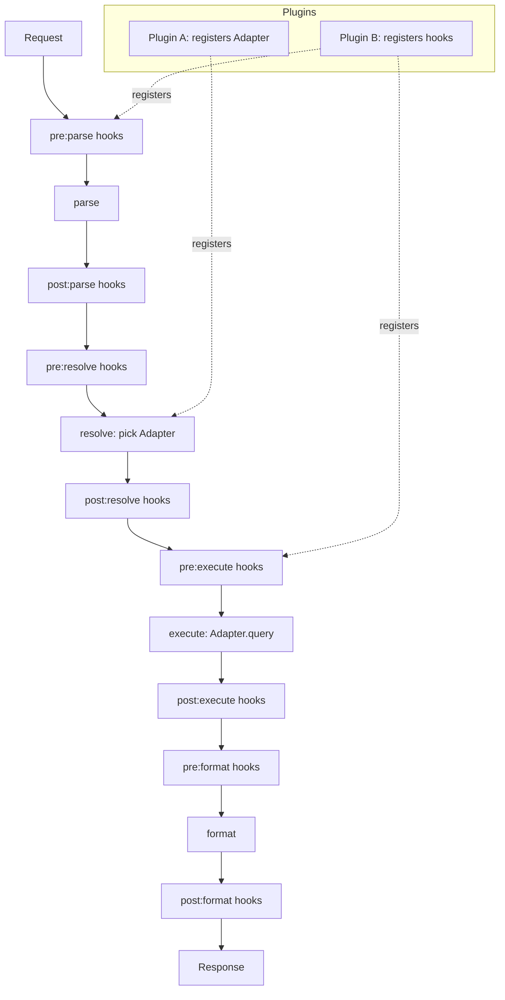

# Semantic Layer Engine — Architecture Spec

## 1. Goal

A lightweight, language-agnostic starter/toolkit for a data semantic layer. Not a full BI platform. Optimized for:

- **Readability** — a junior dev can understand the entire core in one sitting.
- **Extensibility** — new data sources, behaviors, and cross-cutting logic are added without editing core files.
- **No lock-in** — no required external framework; core uses only standard language features.

## 2. Non-Goals (do not build these into core)

- Query optimization / planning
- Multi-source join engine
- Caching, retries, connection pooling
- Auth / row-level security
- A metric definition DSL or query language

These are legitimate future needs but belong in **plugins**, not core. If a feature request would grow `Engine`, redirect it to a plugin instead.

## 3. Core Boundary — What Is Core vs. What Is Not

This is the single most important rule for the coding agent to enforce. If unsure whether new code belongs in core, this table decides it.

| | **Core** | **Adapter** | **Plugin** | **Hook** |
|---|---|---|---|---|
| Knows about a specific data source (SQL, REST, file, etc.) | ❌ never | ✅ yes, one per adapter | only indirectly (registers adapters) | ❌ never |
| Knows about business rules (caching, auth, logging, retry) | ❌ never | ❌ never | ✅ yes, via hooks it registers | ✅ yes, this is its whole job |
| Can be imported/required by core | — | ❌ no (core never imports a specific adapter) | ❌ no (core never imports a specific plugin) | ❌ no |
| Imports core | n/a | ✅ implements core's `Adapter` contract | ✅ implements core's `Plugin` contract, calls `engine.adapters.register` / `engine.hooks.register` | ✅ receives `Context` defined by core |
| Allowed to change the 4-stage pipeline shape | ✅ only place this can happen | ❌ | ❌ | ❌ |
| Ships inside `/core` | ✅ | ❌ (`/adapters`) | ❌ (`/plugins`) | ❌ (lives inside a plugin file) |

**One-line test for the agent:** if the code needs to know *which* database, API, cache, or auth system is being used — it is not core. If it needs to know *when in the pipeline* something should happen — it is a hook. If it bundles adapters + hooks together for one purpose — it is a plugin.

## 4. Core Concepts

| Concept | Responsibility |
|---|---|
| **Engine** | Orchestrates the pipeline. Contains no business logic. |
| **Context** | Mutable object passed through the whole pipeline. Shared state for the request, result, and scratch space. |
| **Adapter** | Connects to one data source. Implements a fixed contract (connect, query, schema). |
| **Plugin** | A bundle that registers adapters and/or hooks at load time. The unit of extension. |
| **Hook** | A function bound to `pre:<stage>` or `post:<stage>`, run in priority order. |

## 5. Pipeline

Fixed sequence of stages. Core only implements minimal default logic per stage; everything else is added via hooks.

```
parse → resolve → execute → format
```

- **parse** — turn raw request into an internal query representation.
- **resolve** — pick which adapter(s) will serve the request.
- **execute** — run the query against the adapter(s), produce a raw result.
- **format** — shape the raw result into the response.

Every stage fires two hook points: `pre:<stage>` before the stage runs, `post:<stage>` after.

## 6. Diagram



Any hook can set `context.stop = true` to short-circuit the pipeline (e.g. cache hit, validation failure, auth denial). When `stop` is set, no further stages or hooks run.

## 7. Contracts (language-agnostic — implement as interface/protocol/abstract class per language convention)

### Adapter
```
Adapter:
  name: string
  connect(config) -> void
  query(semantic_query) -> raw_result
  schema() -> schema_object
```

### Plugin
```
Plugin:
  setup(engine) -> void
    # registers adapters via engine.adapters.register(...)
    # registers hooks via engine.hooks.register(stage, fn, priority)
```

### Hook
```
Hook: fn(context) -> void
  # reads/writes context.result, context.meta
  # may set context.stop = true
```

### Context
```
Context:
  stage: string
  request: object          # original input, read-only by convention
  result: any               # written by execute/format stages
  meta: map<string, any>    # scratch space for plugin-to-plugin communication
  stop: bool                # short-circuit flag
```

### Engine (core, minimal)
```
Engine:
  hooks: HookManager

  use(plugin) -> engine        # calls plugin.setup(engine)
  run(request) -> result       # executes the 4-stage pipeline with hooks
```

Note (2026-08-30): the `adapters: AdapterRegistry` member was removed —
the adapter contract is realized by the `EngineProvider` family
(`TypedRealizationProvider` descriptors + `EngineUrlParser`, discovered
via ServiceLoader), not by a core-held registry. The `Engine` trait no
longer carries any adapter-registration surface.

## 7a. Worked Examples

These show the boundary from Section 3 in practice. Pseudocode — translate to the target language's idioms (class, struct+interface, module, whatever fits).

### Example: Adapter

Knows about one specific data source. Nothing else. Never imports a plugin or another adapter.

```
adapter InMemoryAdapter implements Adapter:
  name = "in_memory"
  data = {}

  connect(config):
    self.data = config.seed_data or {}

  query(semantic_query):
    table = semantic_query.table
    if table not in self.data:
      raise Error("unknown table: " + table)
    return self.data[table]

  schema():
    return { table_name: list(row_keys) for table_name, rows in self.data }
```

### Example: Hook

Knows *when* in the pipeline to act. Never knows which adapter is in use unless it reads it off `context.meta`. Lives inside a plugin file, not standalone in core.

```
function cacheReadHook(context):
  key = hash(context.request)
  if cache.has(key):
    context.result = cache.get(key)
    context.stop = true          # short-circuits remaining stages

function cacheWriteHook(context):
  key = hash(context.request)
  cache.set(key, context.result)
```

### Example: Plugin

Bundles adapters and/or hooks for one purpose. This is the unit a contributor publishes and the unit `engine.use(...)` consumes.

```
plugin CachePlugin implements Plugin:
  setup(engine):
    engine.hooks.register("pre:execute",  cacheReadHook,  priority = 50)   # core range
    engine.hooks.register("post:execute", cacheWriteHook, priority = 50)

plugin PostgresPlugin implements Plugin:
  setup(engine):
    engine.adapters.register(new PostgresAdapter())
    engine.hooks.register("pre:resolve", validatePostgresConfigHook, priority = 100)  # first-party range
```

A plugin can register only adapters, only hooks, or both — whichever the extension needs. `Engine` never knows `CachePlugin` or `PostgresPlugin` exist; it only ever calls the generic `Plugin.setup(engine)` contract.

## 8. Hook Ordering Convention

Priority is a number; lower runs first. Reserve ranges to prevent collisions between core and community plugins:

| Range | Owner |
|---|---|
| 0–99 | Core / built-in behavior |
| 100–899 | Official/first-party plugins |
| 900+ | Community / user plugins |

Document this convention wherever `hooks.register` is exposed.

## 9. Error Handling Policy

- A hook that throws **fails the whole pipeline** by default (fail-fast). This is intentional: silent partial failures are worse for a starter kit than a loud crash.
- Plugins that need isolated, non-fatal hooks must catch their own exceptions inside the hook function.
- Adapter errors during `execute` propagate unchanged — do not swallow or wrap silently.

## 10. Extension Points — How to Add Things

**Add a data source:** implement the `Adapter` contract, register it inside a `Plugin.setup()`. No core changes.

**Add cross-cutting behavior (logging, caching, auth check):** write hook functions, register them on the relevant `pre:`/`post:` stage inside a `Plugin.setup()`. No core changes.

**Change core pipeline shape (e.g. add a new stage):** this is the one change that touches `Engine`. Should be rare and deliberate — treat as a breaking change requiring discussion, not a routine PR.

## 11. Repo Structure (suggested, adapt to language conventions)

```
/core            # Engine, Context, Adapter contract (via EngineProvider seam), Plugin contract, HookManager
/adapters        # built-in reference adapters (e.g. in-memory, REST)
/plugins         # built-in reference plugins (e.g. logging, cache)
/tests/contract  # conformance test suite every Adapter must pass
/examples        # copy-paste starter plugin + starter adapter
```

## 11a. Deployment Module (added 2026-08-15, per ADR-006 Post-#65 Refinement)

The repo also ships a **runnable deployment module** (e.g. `sm8-server`) that owns:

- CLI parsing (entry-point args)
- ServiceLoader-based plugin discovery
- Connector URL realization (calls `MCPEngineProvider.realize(url)` — the typed contract; see `adapters.md` Rule 3)
- JVM lifecycle hooks (shutdown, port release)

The deployment module lives **OUTSIDE** `/core` AND **OUTSIDE** the transport library (e.g. `sm8-platform`). The transport library contains zero deployment concerns — its `main()` lives ONLY in the deployment module. **The transport library must not import any adapter-specific types** (Spark, Trino, etc.); the deployment module likewise must not — it only invokes the typed `realize(url)` contract.

Transport user-facing surfaces (HTTP server, MCP wire, REST) all converge on the same transport library; the deployment module is the single binary that hosts them. Wire shape (MCP / REST) is decided by the transport handler chosen at bind time, not by separate deployment modules.

## 12. Adapter Conformance Testing

Every adapter — built-in or community — must pass a shared contract test suite covering:

- `connect()` with valid config succeeds
- `connect()` with invalid config raises a clear error (not a silent no-op)
- `query()` returns data matching `schema()`
- `query()` on a malformed semantic query raises, does not return partial/garbage data

This is what keeps "customize freely" from degrading into "customize into a broken state" — required for any adapter PR to merge.

## 13. Definition of Done for This Spec

An implementation is complete when:

- [ ] Core (`Engine`, `Context`, `HookManager`) has no dependency on any specific adapter or plugin (the adapter contract is realized by the `EngineProvider` seam, not a core-held registry)
- [ ] At least one reference adapter and one reference plugin exist and pass conformance tests
- [ ] A new adapter can be added by a contributor without touching any file outside `/adapters` and their own plugin
- [ ] A new hook can be added without touching any file outside their own plugin
- [ ] README documents the priority range convention and error handling policy from sections 7–8
